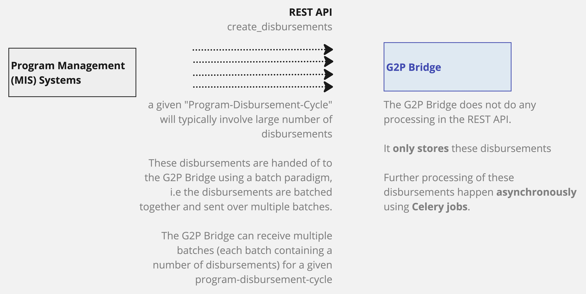

---
layout:
  title:
    visible: true
  description:
    visible: false
  tableOfContents:
    visible: true
  outline:
    visible: true
  pagination:
    visible: true
---

# Scaling for High Volumes

The G2P Bridge is designed to perform in high volume disbursement scenarios. To achieve this, all the processing in the G2P Bridge is done asynchronously.&#x20;

The disbursement instructions from the upstream Program MIS / PBMS systems are received by the G2P Bridge via. a REST API. The "create\_disbursements" API is designed to receive multiple API invocations for a single "program-disbursement-cycle". Each invocation of the API brings a payload that contains a list of disbursements.

<figure><figcaption>
create_disbursements in G2P Bridge (from upstream Program MIS systems)
</figcaption></figure>
